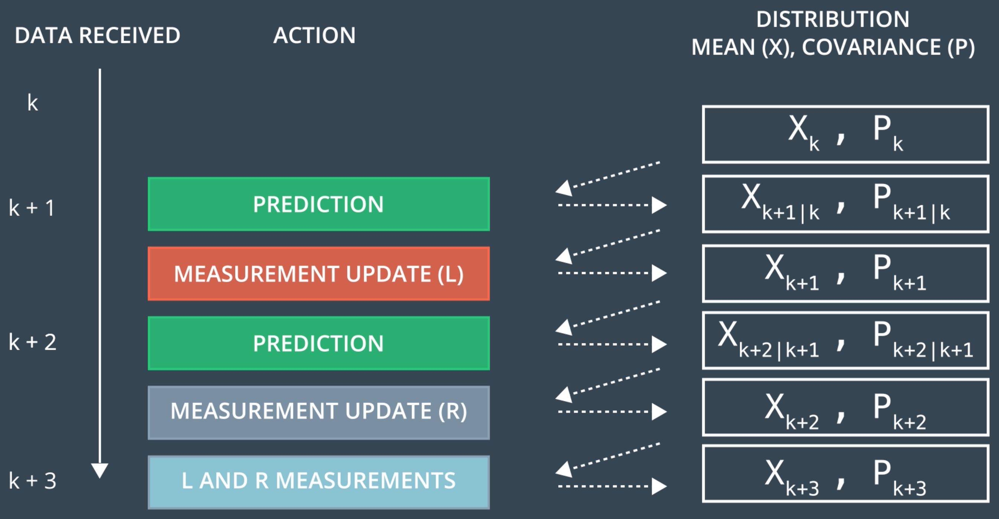
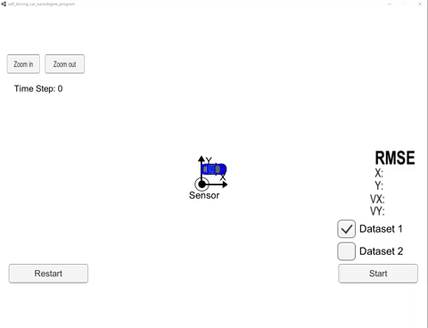

# Extended Kalman Filter

## Overview

Kalman Filter is a mathematical approach of determining the state of the system. It calculates the system's state using a mathematical model of the process and clarifies the state using the measurement information. For an introduction to Extended Kalman Filters (EKFs), see [here](https://en.wikipedia.org/wiki/Extended_Kalman_filter). 
  
Sensor fusion - is a process of combining measurements from different sensors to get one accurate picture. Sensor Fusion for object tracking using RADAR and LIDAR sensors is an actual task for the self-driving car. 

Image: Udacity Self-Driving Car Nanodegree  

## Use Instructions

If you have already installed all the necessary dependencies for the projects in term 2 you should be good to go! If not, you should install them to get started on this project => [Getting Started for Term 2](../term2_How_to_get_started). 

1. Clone this repo.
2. Make a build directory: `mkdir build && cd build`
3. Compile: `cmake .. && make`
   * On Windows, you may need to run: `cmake .. -G "Unix Makefiles" && make`
4. Run it: `./ExtendedKF`

Once you launched the executable, simply run the simulator app and select the EKF/UKF simulation.

## Goal of this project

In this project we implement the Extended Kalman Filter (EKF) in C++ to combine data from RADAR and LIDAR. Noisy lidar and radar measurements detecting a bicycle that travels around your vehicleto are provided. Using the Kalman filter and the measurements you are able to track the bicycle's position and velocity. 

## General Process

There are three main steps for programming a Kalman filter:

* **initializing** Kalman filter variables
* **predicting** where our object is going to be after a time step Δt
* **updating** where our object is based on sensor measurements

Then the prediction and update steps repeat themselves in a loop.

To measure how well the Kalman filter performs, the root mean squared error comparing the Kalman filter results with the provided ground truth will  be calculated afterwards. The simulator provides the ground truth state of the object to be tracked and displays the calculated root mean squared error (RMSE).

## File structure

Files in the Github src Folder:
1. main.cpp: 
  * communicates with the Term 2 Simulator receiving data measurements
  * calls a function to run the Kalman filter
  * calls a function to calculate RMSE
2. FusionEKF.cpp:
  * initializes variables and matrices (x, F, H_laser, H_jacobian, P, etc.) 
  * initializes the Kalman filter position vector with the first sensor measurements
  * modifies the F and Q matrices prior to the prediction step based on the elapsed time between measurements
  * calls the predict function
  * calls the update step for either the lidar or radar sensor measurement 
3. kalman_filter.cpp:
  * defines the KalmanFilter class containing the x vector as well as the P, F, Q, H and R matrices
  * defines functions for the prediction step 
  * as well as the Kalman filter update step (lidar) 
  * and extended Kalman filter update step (radar)
4. tools.cpp
  * function to calculate RMSE and the Jacobian matrix

## Results

Lidar measurements are red circles, radar measurements are blue circles with an arrow pointing in the direction of the observed angle, and estimation markers are green triangles. The video below shows what the simulator looks like when a c++ script is using its Kalman filter to track the object. The simulator provides the script the measured data (either lidar or radar), and the script feeds back the measured estimation marker, and RMSE values from its Kalman filter. 

Using this submitted code for the first data set you will get the following vaules for RMSE:

||RMSE|
| :---:         |     :---:      |
|X | 0.0977 |
|Y | 0.0850 |
|Vx | 0.4025 |
|Vy | 0.4645 |

Plotting the lissajous figure using the visualization toolkit generates the following image.  This is specifically for the first data set:

As you can see in the visualization, you can barely see the estimate since the ground truth nearly always covers it. The most variation is at the areas where the lissajous figure curves most rapidly. This is not surprising given the nature of the Extended Kalman Filter with the linear nature of its prediction.

## Visualisation Tools

Visualization of the output is courtesy of the Jupyter visualization notebook 
[Sensor Fusion Toolkit](https://github.com/udacity/CarND-Mercedes-SF-Utilities) from the 
Mercedes team that accompanies the project.

## Editor Settings

We've purposefully kept editor configuration files out of this repo in order to
keep it as simple and environment agnostic as possible. However, we recommend
using the following settings:

* indent using spaces
* set tab width to 2 spaces (keeps the matrices in source code aligned)

## Code Style

Please (do your best to) stick to [Google's C++ style guide](https://google.github.io/styleguide/cppguide.html).