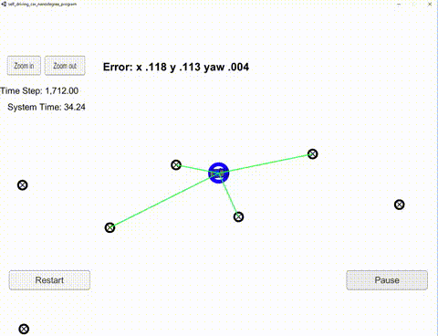

# Particel Filter - Kidnapped Vehicle

## Overview

In this project you will implement a 2 dimensional particle filter in C++. Your particle filter will be given a map and some initial localization information (analogous to what a GPS would provide). At each time step your filter will also get observation and control data.


## Use Instructions

If you have already installed all the necessary dependencies for the projects in term 2 you should be good to go! If not, you should install them to get started on this project => [Getting Started for Term 2](../term2_How_to_get_started). 

1. Clone this repo.
2. Make a build directory: `mkdir build && cd build`
3. Compile: `cmake .. && make`
   * On Windows, you may need to run: `cmake .. -G "Unix Makefiles" && make`
4. Run it: `./particle_filter`

Once you launched the executable, simply run the simulator app and select the "Project 3: Kinapped Vehicle" simulation.

Alternatively some scripts have been included to streamline this process, these can be leveraged by executing the following in the top directory of the project:

1. ./clean.sh
2. ./build.sh
3. ./run.sh

## Goal of this project

Your robot has been kidnapped and transported to a new location! Luckily it has a map of this location, a (noisy) GPS estimate of its initial location, and lots of (noisy) sensor and control data.
Does your particle filter localize the vehicle within the desired accuracy?
Does your particle run within the specified time of 100 seconds?
Does your code use a particle filter to localize the robot?

## General Process

The new Term 2 Simulator includes a graphical version of the Project 3 Kidnapped Vehicle Project. Running the simulator you can see the path that the car drives along with all of its landmark measurments.
The simulator provides the noisy position data, vehicle controls, and noisy observations. The script feeds back the best particle state. 

## File structure
The directory structure of this repository is as follows:

```
root
|   build.sh
|   clean.sh
|   CMakeLists.txt
|   README.md
|   run.sh
|
|___data
|   |   
|   |   map_data.txt
|   
|   
|___src
    |   helper_functions.h
    |   main.cpp
    |   map.h
    |   particle_filter.cpp
    |   particle_filter.h
```

The only file you should modify is `particle_filter.cpp` in the `src` directory. The file contains the scaffolding of a `ParticleFilter` class and some associated methods. Read through the code, the comments, and the header file `particle_filter.h` to get a sense for what this code is expected to do.

If you are interested, take a look at `src/main.cpp` as well. This file contains the code that will actually be running your particle filter and calling the associated methods.

## Inputs to the Particle Filter
You can find the inputs to the particle filter in the `data` directory. 

#### The Map*
`map_data.txt` includes the position of landmarks (in meters) on an arbitrary Cartesian coordinate system. Each row has three columns
1. x position
2. y position
3. landmark id

### All other data the simulator provides, such as observations and controls.

> * Map data provided by 3D Mapping Solutions GmbH.

## Results

The simulator displays the best particle's sensed positions, along with the corresponding map ID associations. This can be extremely helpful when making sure transition and association calculations were done correctly. Below is a video of what it looks like when the simulator successfully is able to track the car to a particle. Notice that the green laser sensors from the car nearly overlap the blue laser sensors from the particle, this means that the particle transition calculations were done correctly.
The job is to build out the methods in `particle_filter.cpp` until the simulator output says:

```
Success! Your particle filter passed!
```



The resulting videos are in the repo, if you are interested.  

## Editor Settings

We've purposefully kept editor configuration files out of this repo in order to
keep it as simple and environment agnostic as possible. However, we recommend
using the following settings:

* indent using spaces
* set tab width to 2 spaces (keeps the matrices in source code aligned)

## Code Style

Please (do your best to) stick to [Google's C++ style guide](https://google.github.io/styleguide/cppguide.html).

## Contributing

No further updates nor contributions are requested.  This project is static.

## License

Term1_project1_lane_finding results are released under the [MIT License](./LICENSE)